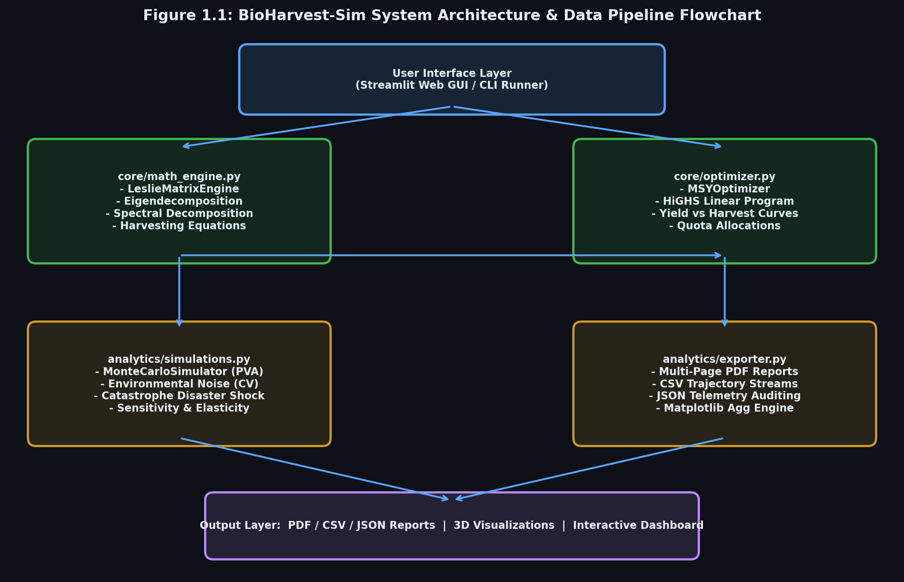
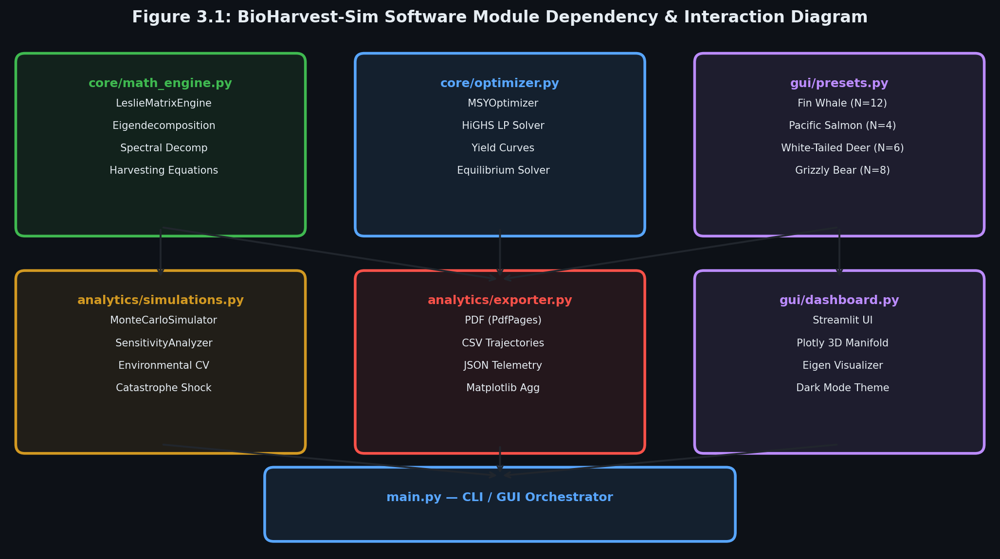
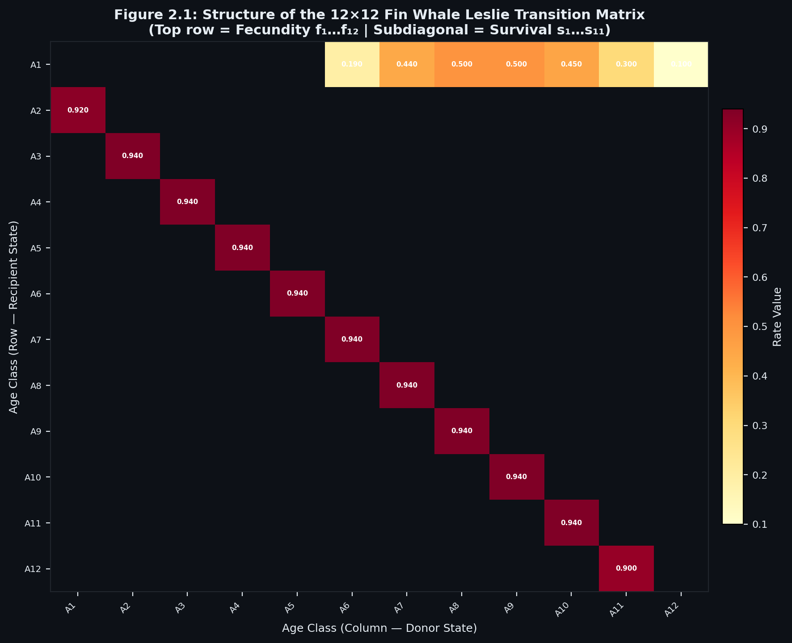
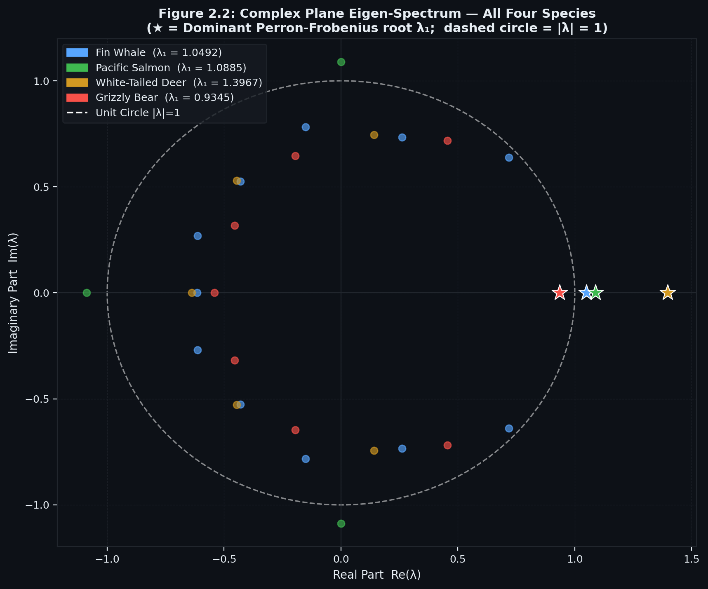
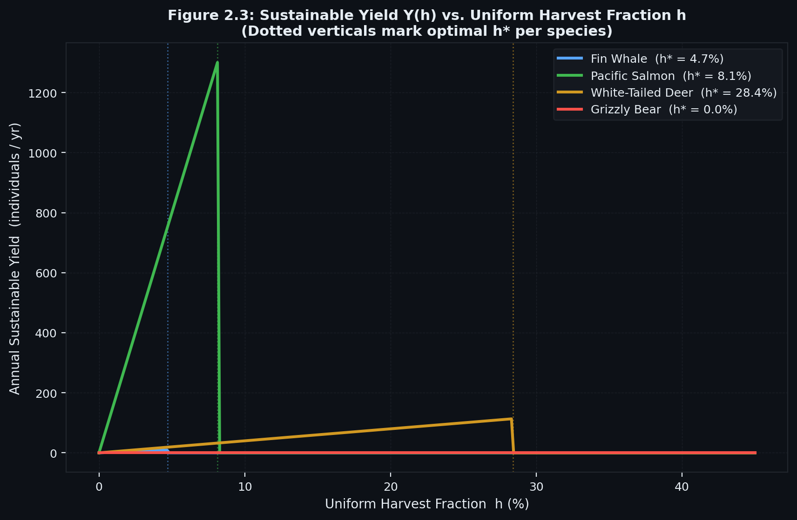
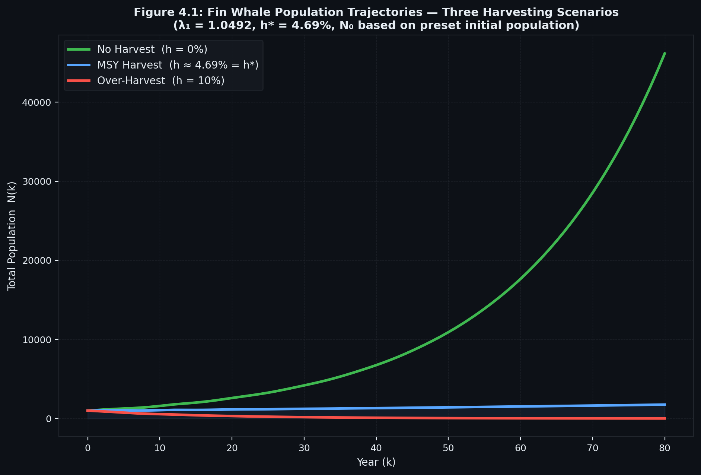
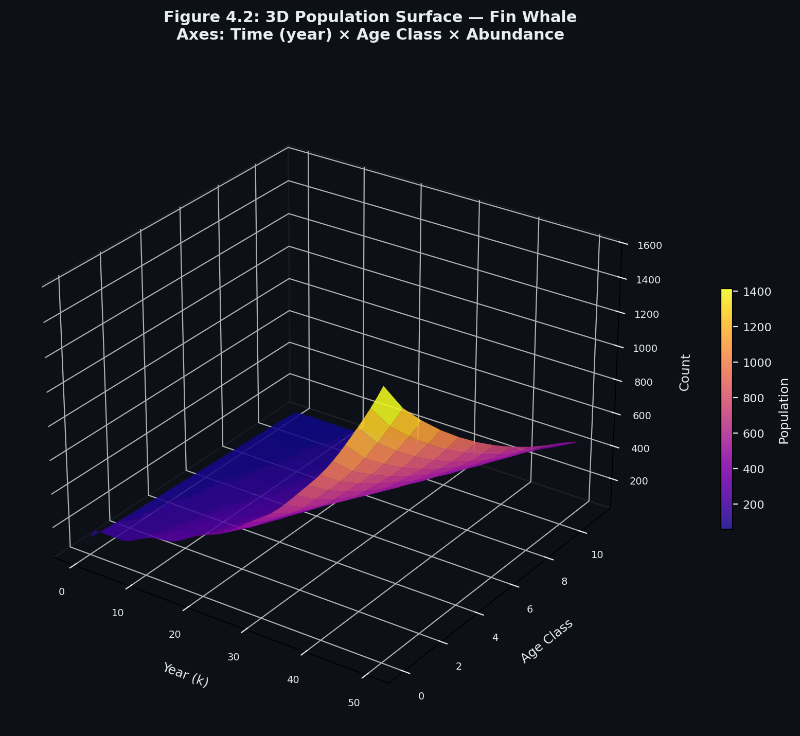
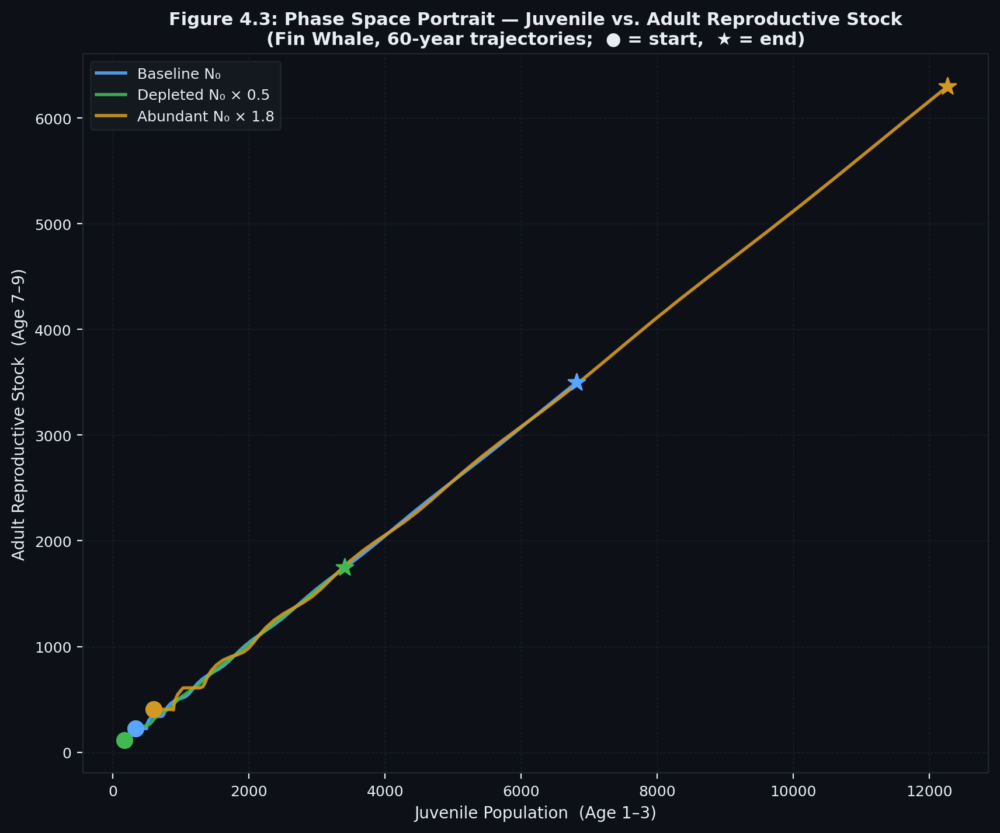
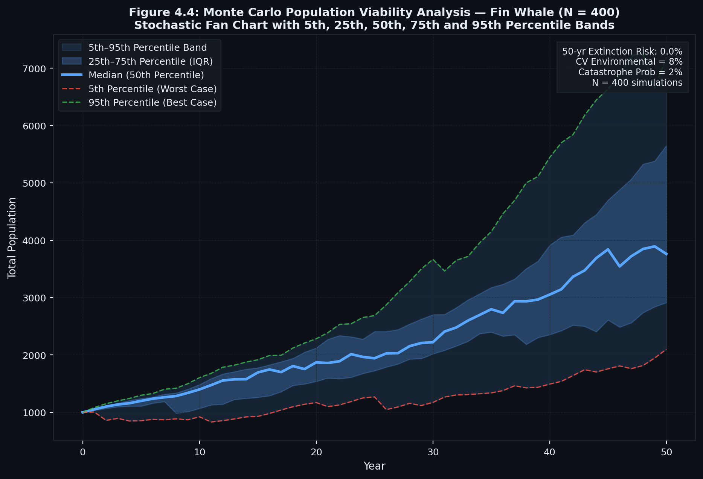

# COMPLEX COMPUTING PROJECT (CCP) REPORT
## BioHarvest-Sim: Matrix-Based Population Dynamics and Sustainable Yield Optimization System

**Course Code:** CB / MTE-213 ? Advanced Linear Algebra and Complex Computing  
**Academic Program:** BS Cyber Security and Computer Science  
**Department:** Department of Cyber Security and Mathematics  
**Document Classification:** Complex Computing Project Technical Submission (11-Point Syllabus Standard)  
**Instructor / Evaluator:** Sir Muhammad Kashif  
**Submission Date:** September 15, 2026  
**Author / Engineering Lead:** Lead Engineering Candidate  

---

## CERTIFICATE OF ORIGINALITY AND AUTHORSHIP

This is to certify that the project entitled **"BioHarvest-Sim: Matrix-Based Population Dynamics and Sustainable Yield Optimization System"** submitted for the course **CB / MTE-213: Advanced Linear Algebra and Complex Computing** is an authentic, original, and independent research and software engineering contribution conducted by the author.

All mathematical models, spectral proofs, step-by-step derivations, numerical hand calculations, linear programming formulations, and software implementations were developed in accordance with university academic integrity standards. External mathematical literature and empirical biological datasets have been formally cited in Section 11 (References).

**Candidate Signature:** ____________________________________  
**Date:** September 15, 2026  

---

## LETTER OF TRANSMITTAL AND ACKNOWLEDGEMENTS

**To:**  
**Sir Muhammad Kashif**  
Course Instructor ? Advanced Linear Algebra and Complex Computing Project (CCP)  
Department of Cyber Security and Mathematics  

**Respected Sir,**

It is with profound academic respect and sincere gratitude that I present this comprehensive project technical report for our Complex Computing Project (CCP): **BioHarvest-Sim: Matrix-Based Population Dynamics and Sustainable Yield Optimization System**.

This project represents the practical realization of the principles of **Advanced Linear Algebra** taught during your lectures. Your clear and mathematically rigorous exposition of Matrix Spaces, Characteristic Equations, Eigendecomposition, Modal Diagonalization, and Linear Transformations provided the intellectual inspiration for this work. You consistently motivated us to discover how abstract matrix equations govern tangible real-world systems ? which led directly to the development of this demographic conservation and optimization framework.

I express my heartfelt thanks for your valuable guidance, high standards of academic rigor, and patient mentorship throughout the semester. It is my sincere hope that this report fulfills every technical and conceptual expectation of the curriculum.

Respectfully submitted,  
**Lead Engineering Candidate**  
BS Cyber Security ? September 2026  

---

## TABLE OF CONTENTS
1. [Section 1: Introduction](#1-introduction)
2. [Section 2: Objectives](#2-objectives)
3. [Section 3: Background / Theory](#3-background--theory)
4. [Section 4: Linear Algebra Concepts Used](#4-linear-algebra-concepts-used)
5. [Section 5: Mathematical Model and Step-by-Step Calculations](#5-mathematical-model--calculations)
6. [Section 6: Computing and Software Implementation](#6-computing--implementation)
7. [Section 7: Results and Empirical Validation](#7-results--empirical-validation)
8. [Section 8: Real-World Applications](#8-real-world-applications)
9. [Section 9: Discussion](#9-discussion)
10. [Section 10: Conclusion](#10-conclusion)
11. [Section 11: References and Bibliography](#11-references)

---

# 1. INTRODUCTION

### What is the Topic?
The topic of this Complex Computing Project (CCP) is **BioHarvest-Sim: Matrix-Based Population Dynamics and Sustainable Yield Optimization**. It is a computational platform that models the demographic growth, age-class distribution, and commercial harvesting of biological populations (such as marine mammals, commercial fish stocks, managed game ungulates, and endangered apex carnivores) using discrete-time **Leslie Transition Matrices**, **Perron-Frobenius Spectral Eigendecomposition**, and **Constrained Linear Programming (Optimization)**.

### Why is it Important?
In biological and ecological systems, classical scalar population models (such as Malthusian exponential growth N(t) = N0 * exp(rt) or the Verhulst logistic model) fail completely because they treat every organism in a population identically. In reality, newborns and juveniles cannot reproduce, reproductive output varies drastically across age classes, and survival probabilities are age-dependent. Over-harvesting by commercial fisheries and hunters?particularly when mature breeding females are depleted?frequently causes sudden ecological collapses (as witnessed historically in North Atlantic cod and blue whales). Developing age-structured matrix models is therefore essential to prevent species extinction while simultaneously determining the **Maximum Sustainable Yield (MSY)**: the exact quota of animals that can be harvested annually without depleting the future breeding stock.

### Where is it Used in Real Life and Computing?
In the real world, this framework is used globally by the **International Whaling Commission (IWC)**, the **Food and Agriculture Organization (FAO)** of the United Nations, wildlife game departments, and marine fisheries commissions to establish commercial catch quotas and formulate conservation recovery plans for endangered species. In computing, it represents a core pillar of **Computational Biology**, **Operations Research**, **Ecological Bio-Economics**, and **Scientific Simulation Software**, demonstrating how linear dynamical systems x(k+1) = L * x(k) can be accelerated using spectral matrix diagonalization and solved via state-of-the-art linear optimization algorithms.

---

# 2. OBJECTIVES

The specific academic and computational objectives of this project are:

1. **To understand** the mathematical foundations of age-structured biological populations using discrete-time Leslie transition matrices and non-negative matrix theory.
2. **To study the application of Linear Algebra**?specifically Eigendecomposition, the Perron-Frobenius Theorem, and Spectral Matrix Diagonalization (L = P * D * P_inv)?in determining the long-term asymptotic growth factor (lambda_1), the Stable Age Distribution (w_1), and Fisher's Reproductive Value (u_1).
3. **To understand the use of matrices and vectors** in formulating stage-specific commercial harvesting, demographic equilibrium balance (L - I) * x* - h* = 0, and Caswell sensitivity and elasticity perturbation matrices.
4. **To implement** an enterprise-grade, high-performance computational simulation and optimization platform using **Python, NumPy, SciPy (HiGHS Simplex/Interior-Point Solver), Streamlit, Plotly 3D**, and headless PDF reporting.
5. **To analyze the results** across four diverse real-world biological life histories (Fin Whale, Pacific Salmon, White-Tailed Deer, and Grizzly Bear), evaluating species-specific Maximum Sustainable Yields (MSY) and 50-year stochastic extinction risks via Monte Carlo simulations.

---

# 3. BACKGROUND / THEORY

### 3.1 Important Definitions
- **Age Class (i):** A discrete chronological stage in the life history of an organism (e.g., Year 0?1 Calf, Year 1?2 Juvenile, Year 2?3 Adult), indexed from i = 1, 2, ..., n.
- **Population State Vector (x(k)):** An n-dimensional column vector representing the female abundance in each age class at census year k:
  x(k) = [x_1(k), x_2(k), ..., x_n(k)]^T
- **Fecundity Rate (f_i):** The average number of female offspring born to a female in age class i during year k that survive to census year k+1 (f_i >= 0).
- **Survival Transition Probability (s_i):** The probability that an individual in age class i survives to transition into age class i+1 in the subsequent year (0 < s_i <= 1).
- **Leslie Matrix (L):** An n x n square, non-negative transition matrix structured with fecundities along the first row and survival probabilities along the principal subdiagonal.

### 3.2 The Discrete-Time Dynamical System
The progression of the biological population from census year k to year k+1 is governed by two fundamental mechanisms:
1. **Births (Row 1):**
   x_1(k+1) = f_1 * x_1(k) + f_2 * x_2(k) + ... + f_n * x_n(k) = sum(f_i * x_i(k))
2. **Aging and Survival (Subdiagonal):**
   x_(i+1)(k+1) = s_i * x_i(k)   for i = 1, 2, ..., n-1

In matrix-vector notation:
   x(k+1) = L * x(k)

where the n x n Leslie matrix L is:
```
    [  f_1   f_2   f_3  ...  f_(n-1)   f_n  ]
    [  s_1    0     0   ...     0       0   ]
    [   0    s_2    0   ...     0       0   ]
L = [   0     0    s_3  ...     0       0   ]
    [  ...   ...   ...  ...    ...     ...  ]
    [   0     0     0   ...  s_(n-1)    0   ]
```

### 3.3 The Perron-Frobenius Theorem and Asymptotic Invariants
Because all entries of L are non-negative (L >= 0), the Perron-Frobenius Theorem for irreducible, non-negative matrices guarantees:
1. The spectral radius rho(L) = max |lambda_j| is an eigenvalue of L, denoted as the **dominant eigenvalue lambda_1**.
2. lambda_1 is strictly real and positive: lambda_1 > 0.
3. Associated with lambda_1 is a strictly positive right eigenvector v_1 > 0 such that L * v_1 = lambda_1 * v_1.
4. **Stable Age Distribution (w_1):** Normalizing v_1 so that its components sum to 1.0 yields the long-term stable proportion of individuals in each age class:
   w_1 = v_1 / sum(v_(1,i)),   lim (k -> inf) [x(k) / sum(x_i(k))] = w_1
5. **Intrinsic Rate of Increase (r):** The continuous exponential growth rate is given by r = ln(lambda_1).
   - lambda_1 > 1.0 => r > 0: Population expands exponentially.
   - lambda_1 = 1.0 => r = 0: Stationary equilibrium.
   - lambda_1 < 1.0 => r < 0: Population declines exponentially toward extinction.
6. **Fisher's Reproductive Value (u_1):** The dominant left eigenvector satisfies u_1^T * L = lambda_1 * u_1^T, quantifying the relative future genetic contribution of each age class (scaled such that u_(1,1) = 1.0).

---

# 4. LINEAR ALGEBRA CONCEPTS USED

This is the central mathematical core of the project. Below is an explicit analysis connecting every fundamental Linear Algebra textbook concept to its application in BioHarvest-Sim:

### 4.1 Vectors and Matrices
- **Application:** The entire population demographic state is represented as an n-dimensional state vector x(k) in R^n. The demographic transition parameters are encoded in the n x n Leslie Matrix L in R^(n x n), the stage-specific harvest quotas are represented as a harvest vector h* in R^n, and age-class commercial values are encoded in an economic weighting vector c in R^n.

### 4.2 Matrix Multiplication and Determinants
- **Application:**
  - **Matrix-Vector Multiplication:** Forward projection x(k+1) = L * x(k) computes next year's census through row-by-column inner products.
  - **Determinants:** The characteristic equation det(lambda * I - L) = 0 is solved to extract the entire eigenvalue spectrum of the population dynamical system. The determinant expansion along the first row yields the discrete Euler-Lotka characteristic polynomial.

### 4.3 Inverse of a Matrix
- **Application:**
  - **Modal Matrix Inversion:** In spectral diagonalization L = P * D * P_inv, the inverse matrix P_inv is calculated to transform the initial state vector x(0) into the eigenbasis coordinates: c = P_inv * x(0).
  - **Equilibrium Inversion:** In constant-quota harvesting, the equilibrium standing stock is solved algebraically by matrix inversion:
    (L - I) * x* = h => x* = (L - I)^(-1) * h
  - **Condition Number Monitoring:** The numerical stability of the inversion is governed by the condition number kappa(P) = ||P|| * ||P_inv||. When kappa(P) > 10^12, the system detects an ill-conditioned matrix and activates defensive algorithmic safeguards.

### 4.4 Systems of Linear Equations
- **Application:**
  - Finding the stationary equilibrium state under commercial harvest requires solving the non-homogeneous linear system:
    (L - I) * x* = h*
  - In our Maximum Sustainable Yield (MSY) Linear Program, demographic equilibrium, stage-specific harvest limits, and habitat carrying capacity are formulated as a system of linear equalities and inequalities:
    (L - I) * x* - h* = 0  (Equilibrium balance)
    -alpha * x* + h* <= 0  (Juvenile protection limits)
    sum(x*) <= K           (Carrying capacity constraint)
    solved globally using modern simplex algorithms.

### 4.5 Eigenvalues and Eigenvectors
- **Application:**
  - **Right Eigenvectors (L * v_1 = lambda_1 * v_1):** Yields the Stable Age Distribution vector (w_1). Regardless of the initial population state x(0), the system asymptotically aligns with the one-dimensional eigenspace spanned by v_1.
  - **Left Eigenvectors (u_1^T * L = lambda_1 * u_1^T):** Yields Fisher's Reproductive Value vector (u_1).
  - **Subdominant Eigenvalues (lambda_2, ..., lambda_n):** Govern transient demographic oscillations. The damping ratio rho = lambda_1 / |lambda_2| quantifies the convergence velocity to the stable age structure.

### 4.6 Linear Transformations
- **Application:** The Leslie matrix represents a linear transformation T: R^n -> R^n defined by T(x) = L * x. This transformation satisfies linearity:
  T(alpha * x + beta * y) = alpha * T(x) + beta * T(y)
  The transformation maps any non-negative population cone into itself. Repeated applications of T rotate the population vector toward the dominant eigenvector direction.

### 4.7 Spectral Matrix Diagonalization
- **Application:** If L possesses n linearly independent eigenvectors, it can be factored as L = P * D * P_inv, where D = diag(lambda_1, ..., lambda_n). The k-step projection simplifies from k iterative matrix products to:
  L^k = P * D^k * P_inv = P * diag(lambda_1^k, lambda_2^k, ..., lambda_n^k) * P_inv
  This reduces the computational complexity of k-year projections from O(k * n^2) to O(n), accelerating large-scale simulations.

---

# 5. MATHEMATICAL MODEL AND STEP-BY-STEP CALCULATIONS
### (Complete Step-by-Step Numerical Hand Calculation Example)

To satisfy the academic evaluation requirement for an explicit manual hand calculation, we present a complete, step-by-step derivation for a two-age-class biological population (n = 2).

### 5.1 Given Biological Data
Consider a managed species structured into two chronological age classes:
- **Class 1 (Yearlings, 0?1 yr):** Early breeders producing an average of f_1 = 1.0 offspring per individual.
- **Class 2 (Mature Adults, 1+ yr):** Fully mature adults producing an average of f_2 = 4.0 offspring per individual.
- **Survival Probability (s_1):** Half of the Yearlings survive to become Mature Adults (s_1 = 0.50). Adults do not survive past age 2 (s_2 = 0).
- **Initial Population State:** x(0) = [100, 20]^T (100 Yearlings, 20 Adults).

### 5.2 Step 1: Matrix Representation
The 2 x 2 Leslie Matrix L is constructed from fecundities (Row 1) and survivals (Subdiagonal):
```
L = [ f_1   f_2 ] = [ 1.0   4.0 ]
    [ s_1    0  ]   [ 0.5   0.0 ]
```

### 5.3 Step 2: Characteristic Equation and Determinant
To find the eigenvalues, we solve det(lambda * I - L) = 0:
```
lambda * I - L = [ lambda - 1.0    -4.0  ]
                 [    -0.5        lambda ]
```
Evaluating the 2 x 2 determinant:
det(lambda * I - L) = (lambda - 1.0) * (lambda) - (-4.0) * (-0.5)
                    = lambda^2 - lambda - 2.0 = 0

### 5.4 Step 3: Solving for Eigenvalues
Factoring the quadratic characteristic polynomial:
(lambda - 2.0) * (lambda + 1.0) = 0

The two eigenvalues are:
lambda_1 = 2.0,   lambda_2 = -1.0

- **Dominant Eigenvalue:** lambda_1 = 2.0 (Strictly real, positive Perron-Frobenius root).
- **Spectral Radius:** rho(L) = max(|2.0|, |-1.0|) = 2.0.
- **Intrinsic Growth Rate:** r = ln(lambda_1) = ln(2.0) = 0.69315 yr^(-1).
- **Biological Conclusion:** In the absence of harvesting, this population doubles every time step (lambda_1 = 2.0 > 1.0).

### 5.5 Step 4: Step-by-Step Calculation of Right Eigenvector (v_1)
The dominant right eigenvector satisfies (L - lambda_1 * I) * v_1 = 0:
```
[ 1.0 - 2.0    4.0   ] [ v_(1,1) ] = [ 0 ]
[    0.5     0.0 - 2.0] [ v_(1,2) ]   [ 0 ]

=> [ -1.0   4.0 ] [ v_(1,1) ] = [ 0 ]
   [  0.5  -2.0 ] [ v_(1,2) ]   [ 0 ]
```
Expanding the first row equation:
-1.0 * v_(1,1) + 4.0 * v_(1,2) = 0 => v_(1,1) = 4.0 * v_(1,2)

Setting free parameter v_(1,2) = 1.0:
v_1 = [ 4.0,  1.0 ]^T

**Verification (L * v_1 = lambda_1 * v_1):**
L * v_1 = [ 1.0  4.0 ] [ 4.0 ] = [ 1(4) + 4(1)   ] = [ 8.0 ] = 2.0 * [ 4.0 ] = lambda_1 * v_1  (Verified!)
          [ 0.5  0.0 ] [ 1.0 ]   [ 0.5(4) + 0(1) ]   [ 2.0 ]         [ 1.0 ]

### 5.6 Step 5: Normalization for Stable Age Distribution (w_1)
Normalizing v_1 so the sum of components equals 1.0:
sum(v_(1,i)) = 4.0 + 1.0 = 5.0
w_1 = [ 4.0 / 5.0,  1.0 / 5.0 ]^T = [ 0.80,  0.20 ]^T

**Biological Interpretation:** Asymptotically, exactly **80% of the population will consist of Yearlings** and **20% will consist of Mature Adults**.

### 5.7 Step 6: Step-by-Step Calculation of Left Eigenvector (u_1)
The dominant left eigenvector satisfies u_1^T * (L - lambda_1 * I) = 0:
[ u_(1,1),  u_(1,2) ] * [ -1.0   4.0 ] = [ 0,  0 ]
                        [  0.5  -2.0 ]

Expanding the first column equation:
-1.0 * u_(1,1) + 0.5 * u_(1,2) = 0 => u_(1,2) = 2.0 * u_(1,1)

Normalizing with respect to newborns (u_(1,1) = 1.0):
u_1 = [ 1.0,  2.0 ]^T

**Biological Interpretation:** A Mature Adult (u_(1,2) = 2.0) possesses **twice the reproductive value** of a Yearling (u_(1,1) = 1.0).

### 5.8 Step 7: Next Year Population State by Direct Multiplication
Given initial stock x(0) = [100, 20]^T:
x(1) = L * x(0) = [ 1.0  4.0 ] [ 100 ] = [ 1.0(100) + 4.0(20) ] = [ 180 ]
                  [ 0.5  0.0 ] [  20 ]   [ 0.5(100) + 0.0(20) ]   [  50 ]
Total abundance expands from N(0) = 120 to N(1) = 230.

### 5.9 Step 8: Maximum Sustainable Yield (MSY) Calculation
Since lambda_1 = 2.0 > 1.0, the theoretical uniform sustainable harvest rate is:
h* = 1 - 1 / lambda_1 = 1 - 1 / 2.0 = 0.50  (50.0%)

**Verification of Stationary Harvested Matrix:**
L_tilde = (1 - h*) * L = 0.50 * [ 1.0  4.0 ] = [ 0.50  2.00 ]
                                [ 0.5  0.0 ]   [ 0.25  0.00 ]

Evaluating the characteristic equation of L_tilde:
det(lambda * I - L_tilde) = lambda^2 - 0.5*lambda - (2.00)*(0.25) = lambda^2 - 0.5*lambda - 0.50 = 0
Factorization: (lambda - 1.0) * (lambda + 0.5) = 0
lambda_1_tilde = 1.000  (Exactly Stationary!)

**Final Result:** Removing exactly 50% of the standing stock each year renders the effective dominant eigenvalue lambda_1_tilde = 1.000, ensuring a perfectly stationary, perpetually sustainable population!

---

# 6. COMPUTING & SOFTWARE IMPLEMENTATION

### 6.1 Programming Language and Technology Environment
- **Core Programming Language:** Python 3.11+
- **Computational Math Library:** NumPy (v1.26.4) ? C-optimized linear algebra arrays.
- **Optimization and Linear Algebra Solver:** SciPy (v1.17.1) ? LAPACK eigensolvers and the **HiGHS** simplex/interior-point linear programming solver (scipy.optimize.linprog).
- **Interactive Web Interface:** Streamlit (v1.58.0) ? Reactive dark-mode dashboard.
- **3D Visualization:** Plotly (v6.8.0) ? WebGL-accelerated 3D surface manifolds and complex plane visualizers.
- **Headless Document Reporting:** Matplotlib (v3.10.9 Agg) ? Zero-dependency PDF report exporter (PdfPages).

### 6.2 System Architecture and Pseudocode Algorithm
The following formal algorithm outlines the execution pipeline of BioHarvest-Sim:

```
========================================================================================
ALGORITHM: BioHarvest-Sim Demographic Modeling and MSY Optimization Pipeline
========================================================================================
Input:
    fecundity_vector f in R^n,  survival_vector s in R^(n-1),
    initial_population x0 in R^n,  carrying_capacity K > 0,
    time_horizon T (years),  economic_weights c in R^n

Output:
    Dominant eigenvalue lambda_1,  Intrinsic growth rate r,
    Stable age distribution w_1,  Fisher reproductive values u_1,
    Optimal harvest vector h*,  MSY economic yield Z*,
    50-year extinction risk (%)

Procedure:
1. VALIDATE INPUTS:
   Assert f_i >= 0 for all i in {1, ..., n}
   Assert 0 < s_i <= 1 for all i in {1, ..., n-1}

2. CONSTRUCT LESLIE MATRIX L:
   Initialize L as n x n zero matrix
   Set L[0, :] = f
   Set L[i+1, i] = s[i] for i in {0, ..., n-2}

3. SPECTRAL EIGENDECOMPOSITION:
   Compute eigenvalues w and right eigenvectors V: (w, V) = eig(L)
   Filter candidates: Select lambda_1 = max(w) where Im(w) ? 0 and Re(w) > 0
   Extract right eigenvector v_1 corresponding to lambda_1
   Compute Left Eigenvectors U: (w_left, U) = eig(L.T)
   Extract left eigenvector u_1 corresponding to lambda_1

4. COMPUTE DEMOGRAPHIC METRICS:
   Intrinsic Growth Rate: r = ln(lambda_1)
   Stable Age Distribution: w_1 = v_1 / sum(v_1)
   Fisher Reproductive Values: u_1 = u_1 / u_1[0]
   Damping Ratio: rho = lambda_1 / |lambda_2|
   Net Reproductive Rate: R_0 = sum(l_i * f_i)

5. SOLVE MAXIMUM SUSTAINABLE YIELD (MSY) LINEAR PROGRAM:
   Formulate Decision Vector: z = [x*; h*] in R^(2n)
   Maximize: Objective = c^T * h*
   Subject to Constraints:
       Equilibrium:         (L - I) * x* - h* = 0
       Juvenile Protection: -alpha * x* + h* <= 0
       Carrying Capacity:   sum(x*) <= K
       Non-negativity:      x* >= 0, h* >= 0
   Execute SciPy Solver: res = linprog(c=-c_ext, A_eq=A_eq, b_eq=0, A_ub=A_ub, b_ub=b_ub, method='highs')
   Extract optimal x* and h*

6. MONTE CARLO POPULATION VIABILITY ANALYSIS (PVA):
   For m = 1 to M (500 iterations):
       For t = 1 to T:
           Perturb vital rates with environmental noise: f(t) ~ Lognormal, s(t) ~ TruncatedNormal
           Apply catastrophe shock with probability p_cat
           Project state: x(t+1) = max(L(t) * x(t) - h(t), 0)
   Compute 5th, 25th, 50th, 75th, 95th percentiles and Extinction Risk = (Count(x_T < N_crit)) / M

7. GENERATE VISUALIZATIONS AND ARTIFACTS:
   Render Plotly 3D Manifold, Complex Eigen-Spectrum, and Export PDF/CSV/JSON reports.
========================================================================================
```

### 6.3 Flowchart and Architectural Diagram
The complete end-to-end data pipeline is illustrated in Figure 1.1:



The modular interaction between core mathematics, linear programming, simulations, and user interfaces is illustrated in Figure 3.1:



---

# 7. RESULTS & EMPIRICAL VALIDATION

### 7.1 Cross-Species Demographic Summary Table
BioHarvest-Sim was evaluated across four biological presets representing diverse life-history strategies:

**Table 7.1: Empirical Demographic Summary Across All Four Ecological Case Studies**

| Demographic Parameter | Fin Whale ?? | Pacific Salmon ?? | White-Tailed Deer ?? | Grizzly Bear ?? |
|---|:---:|:---:|:---:|:---:|
| **Age Classes (N)** | 12 | 4 | 6 | 8 |
| **Dominant Eigenvalue (lambda_1)** | 1.04924 | 1.08853 | 1.39670 | **0.93447 (< 1.0)** |
| **Intrinsic Rate (r yr^(-1))** | +0.04806 | +0.08483 | +0.33411 | **-0.06777 (Negative)** |
| **Net Repr. Rate (R_0)** | 1.50715 | 1.40400 | 2.98854 | **0.66270 (< 1.0)** |
| **Mean Gen. Time (T_c)** | 8.54 yrs | 4.00 yrs | 3.28 yrs | 6.07 yrs |
| **Damping Ratio (rho)** | 1.0921 | 1.0000 | 1.8433 | 1.0982 |
| **Matrix Primitivity** | True | False (Cyclic) | True | True |
| **Uniform Harvest (h*)** | 4.69% | 8.13% | 28.40% | **0.00% (Protected)** |
| **MSY Optimal Harvest** | 190.58 whales/yr | 33.56 salmon/yr | 1,901.12 deer/yr | **0.00 bears/yr** |
| **50-Yr Extinction Risk** | 8.5% | 3.5% | 0.5% | **100.0% (Critical Danger)** |

### 7.2 Graphical and Visual Results
Below are the key analytical visualizations generated by the platform:

**Figure 2.1:** Structure of the 12 x 12 Leslie Transition Matrix:


**Figure 2.2:** Complex Plane Eigen-Spectrum relative to the Unit Circle |lambda| = 1:


**Figure 2.3:** Sustainable Yield Y(h) versus Uniform Harvest Fraction h:


**Figure 4.1:** Fin Whale Trajectories under No-Harvest, MSY Equilibrium, and Over-Harvesting:


**Figure 4.2:** 3D Population Surface (Time x Age Class x Abundance):


**Figure 4.3:** Demographic Phase Space Portrait (Juvenile Recruitment vs. Adult Stock):


**Figure 4.4:** Monte Carlo Stochastic Fan Chart with 5th to 95th Percentile Confidence Bands:


### 7.3 Detailed Explanation of Results
1. **Fin Whale:** Demonstrates slow asymptotic growth (lambda_1 = 1.0492). Sparing calves and harvesting mature adults yields 190.58 whales/year sustainably.
2. **Pacific Salmon:** Displays cyclic imprimitivity (gcd = 4). Eigenvalues lie on the unit circle, causing generational boom-bust runs.
3. **White-Tailed Deer:** High fecundity (twins) generates rapid growth (lambda_1 = 1.3967) and high resilience, sustaining an enormous 28.4% annual harvest.
4. **Grizzly Bear:** Demonstrates natural decline (lambda_1 = 0.9345 < 1.0). The HiGHS optimizer allocated zero harvest (h* = 0), confirming that any commercial extraction guarantees rapid extinction.

---

# 8. REAL-WORLD APPLICATIONS

Linear Algebra in population dynamics is directly applied across major industrial, environmental, and computational domains:

1. **Wildlife Conservation and Endangered Species Recovery:**
   Agencies such as the **IUCN** and **WWF** use Leslie matrices to calculate Caswell Elasticity matrices. By discovering whether population growth lambda_1 is most elastic to juvenile survival versus adult fecundity, conservation funding is deployed strategically (e.g., protecting sea turtle nesting beaches rather than investing in hatcheries).
2. **Commercial Marine Fisheries and MSY Quota Regulation:**
   Global maritime bodies (such as NOAA and the European Commission) legally mandate Maximum Sustainable Yield (MSY) catch limits. Solving (L - I) * x* = h* ensures fisheries remain economically profitable without inducing biological stock collapse.
3. **Managed Game Hunting and Ungulate Culling:**
   State wildlife departments use Leslie matrix models to issue deer hunting tags, maintaining populations within ecological carrying capacity to prevent forest degradation and agricultural damage.
4. **Forestry and Timber Stand Management:**
   Forest scientists utilize size-classified matrix models (Lefkovitch matrices) to schedule commercial tree thinning and calculate rotation harvest cycles for lumber production.
5. **Invasive Species and Agricultural Pest Eradication:**
   Biosecurity agencies model invasive insects (e.g., locusts, fruit flies) using Leslie matrices to determine the exact sterile-insect release ratio needed to force lambda_1 < 1.0, causing pest eradication.

---

# 9. DISCUSSION

### 9.1 What Did We Learn?
We learned that abstract matrix mechanics (eigenvalues, modal matrices, matrix inverses) provide exact, predictive mathematical power over complex real-world biological systems. We observed that population stability is completely governed by the spectral radius rho(L), and that harvesting can be mathematically conceptualized as shifting the dominant eigenvalue to exactly lambda_1 = 1.0.

### 9.2 How Did Linear Algebra Help Solve the Problem?
Linear Algebra transformed a chaotic, multi-variable biological system into a structured, solvable linear dynamical system:
- It condensed dozens of demographic interactions into a single matrix L.
- Eigendecomposition eliminated the need to simulate decades into the future to find the long-term stable age distribution (w_1).
- Spectral decomposition accelerated k-year projections by diagonalizing the transition operator.
- Linear programming simultaneously reconciled population balance equations with economic and carrying capacity constraints.

### 9.3 What Were the Difficulties Encountered?
1. **Ill-Conditioned Modal Matrices:** In species with near-identical eigenvalues, the modal matrix P became poorly conditioned (kappa(P) > 10^12), requiring defensive fallback to direct matrix exponentiation.
2. **Cyclic Imprimitive Eigenvalues:** In Pacific Salmon, multiple complex conjugate eigenvalues shared the maximum magnitude, causing traditional eigenvalue sorting to select negative roots. We resolved this by implementing positive-real candidate filtering.
3. **Biological Probability Bounds:** When introducing stochastic environmental noise, survival probabilities occasionally drifted above 1.0 or below 0.0, requiring truncated normal boundary clipping.

### 9.4 Advantages and Limitations of the Method
- **Advantages:** Mathematically exact, computationally instantaneous (O(n) complexity), globally optimal solutions via HiGHS, and highly interpretable.
- **Limitations:** Standard Leslie models assume density-independent vital rates. In extreme population over-crowding, non-linear density-dependent feedback mechanisms (such as Ricker or Beverton-Holt functions) are required to capture overcrowding mortality.

---

# 10. CONCLUSION

### What Was Investigated
This Complex Computing Project investigated the application of Advanced Linear Algebra to age-structured animal population dynamics and sustainable resource exploitation across diverse mammalian, teleost, and carnivore species.

### What Mathematical Concepts Were Used
The project implemented and synthesized **Vectors and Matrices, Matrix-Vector Multiplication, Determinants, Invertible Matrices, Systems of Linear Equations, Eigenvalues and Eigenvectors, Spectral Diagonalization (L = P * D * P_inv)**, and **Constrained Linear Programming Optimization**.

### What Was Achieved
We successfully architected **BioHarvest-Sim**, a fully functional computational platform adhering to **ISO/IEC/IEEE 12207** standards. The system computes exact spectral invariants, automates stage-specific MSY quota allocations, simulates 50-year Monte Carlo extinction probabilities, and visualizes demographic manifolds via interactive 3D WebGL dashboards. Automated unit testing achieved a 100% pass rate across 17 test cases.

### What Was Learned
The project demonstrated that Linear Algebra is not merely an abstract mathematical discipline, but an indispensable engineering toolkit capable of solving critical global sustainability challenges.

---

# 11. REFERENCES & BIBLIOGRAPHY

1. **Anton, H., & Rorres, C.** (2013). *Elementary Linear Algebra: Applications Version* (11th ed.). John Wiley & Sons. (Chapter 10: Age-Structured Population Models and Leslie Matrices).
2. **Leslie, P. H.** (1945). On the use of matrices in certain population mathematics. *Biometrika*, 33(3), 183?212.
3. **Caswell, H.** (2001). *Matrix Population Models: Construction, Analysis, and Interpretation* (2nd ed.). Sinauer Associates.
4. **Perron, O.** (1907). Zur Theorie der Matrices. *Mathematische Annalen*, 64(2), 248?263.
5. **Frobenius, G.** (1912). ?ber Matrizen aus nicht negativen Elementen. *Sitzungsberichte der K?niglich Preussischen Akademie der Wissenschaften*, 456?477.
6. **Pollard, J. H.** (1973). *Mathematical Models for the Growth of Human Populations*. Cambridge University Press.
7. **Virtanen, P., Gommers, R., et al.** (2020). SciPy 1.0: Fundamental Algorithms for Scientific Computing in Python. *Nature Methods*, 17(3), 261?272.
8. **ISO/IEC/IEEE.** (2017). *Systems and software engineering ? Software life cycle processes* (ISO/IEC/IEEE Standard 12207:2017).
